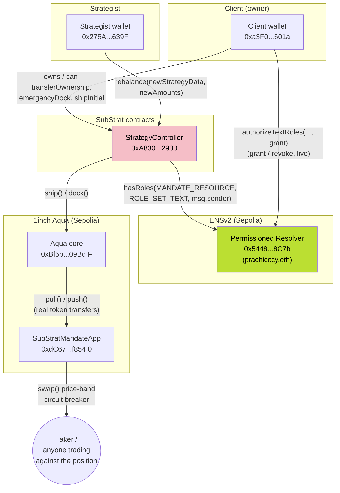

# SubStrat 🎛️

**Let someone else manage part of your DeFi position — without ever giving them your money.**
The strategist can tune it. They can never take it. You can fire them yourself,
instantly, with no one's cooperation needed.

Built for ETHOnline 2026 — 1inch (Build an Aqua App) and ENS (Best Use of ENSv2).

SubStrat is a non-custodial strategy-delegation protocol for 1inch Aqua positions. It lets a client or organization give a strategist narrowly scoped authority to manage a DeFi liquidity strategy without handing over custody of the underlying funds.

A client’s StrategyController becomes the Aqua maker and holds the required Aqua approval, while the strategist can only call a guarded rebalance function. Because Aqua strategies are immutable once shipped, tuning a position means docking the existing strategy and shipping a new one with a fresh strategy hash and updated parameters.

ENSv2 provides the delegation layer. A client grants a strategist a scoped role through Enhanced Access Control, tied to a specific name and strategy resource. The controller checks that role onchain before allowing a rebalance. If the client revokes the role, the strategist’s next attempt fails immediately, without changing the controller or relying on the strategist’s cooperation.

Privy provides the client-side ownership and governance layer. Its wallet and policy controls protect principal-changing actions such as emergency closure, reassignment, and future organization-level approvals. The result is a clear separation between tuning and taking: a strategist can operate within an approved strategy boundary, but cannot withdraw the client’s funds or override the owner.

SubStrat turns Aqua’s self-custodial liquidity into a delegatable primitive: delegate strategy, not custody.

solved with a causal chain across two sponsor primitives:

```
1inch Aqua/SwapVM → what's being delegated: a self-custodial position.
                     Without this, delegation = handing over a wallet.
ENSv2              → who's allowed to touch it, proven/revoked ON-CHAIN.
                     Without this, revocation needs backend/app cooperation.
```

---

## Architecture



**The gate that makes revocation trustless:** `StrategyController.rebalance()`
reads `PERMISSIONS.hasRoles(MANDATE_RESOURCE, ROLE_SET_TEXT, msg.sender)` fresh,
on-chain, on *every call*. Revoking the role via `authorizeTextRoles(..., false)`
on the real ENSv2 resolver kills the strategist's access on the very next
transaction. no code change, no cooperation from SubStrat's app or backend.

`StrategyController` never holds withdrawal power for the strategist: `rebalance()`
can only `dock()` the current Aqua strategy and `ship()` a new one with the same
token amounts. Anything that touches principal (`emergencyDock`, `shipInitial`,
`approveAqua`, `transferOwnership`) is gated by OpenZeppelin's `Ownable`, entirely
separate from the ENS-gated Tuner role, see [Test 2](#test-2--strategist-separation-from-owner-emergency-actions) below.

---

## Deployed contracts (Sepolia)

| Contract | Address |
| --- | --- |
| Aqua (1inch, canonical) | [`0xBf5b6E65a930589159b78F34B6Cdc820Ff809BdF`](https://sepolia.etherscan.io/address/0xBf5b6E65a930589159b78F34B6Cdc820Ff809BdF) |
| `SubStratMandateApp` (custom Aqua app) | [`0xdC67f40c28A73762e0DffB582254183EfF0f8540`](https://sepolia.etherscan.io/address/0xdC67f40c28A73762e0DffB582254183EfF0f8540) |
| `StrategyController` | [`0xA8309342b3918432eB9e4CF7ed5F274DDcf72930`](https://sepolia.etherscan.io/address/0xA8309342b3918432eB9e4CF7ed5F274DDcf72930) |
| Permissioned Resolver (ENS, `prachicccy.eth`) | [`0x54481bf0aD37f63c1aA9E564eCAb72FCEC5A8C7b`](https://sepolia.etherscan.io/address/0x54481bf0aD37f63c1aA9E564eCAb72FCEC5A8C7b) |
| token0 (SSTA, `MockERC20`) | [`0xA9F430492ce6b8DE1162bBa23Db9A2921961C00C`](https://sepolia.etherscan.io/address/0xA9F430492ce6b8DE1162bBa23Db9A2921961C00C) |
| token1 (SSTB, `MockERC20`) | [`0x882F022fca65e3196F4f96F32d0Dc46a32aad00B`](https://sepolia.etherscan.io/address/0x882F022fca65e3196F4f96F32d0Dc46a32aad00B) |

**Other identifiers:**
- ENS name: `prachicccy.eth` — [resolve on ENS explorer](https://explorer.ens.dev/prachicccy.eth/resolver)
- `mandateResource`: `71753273788185224785967372301974439852156737312258433559413852178432066716789`
- Initial `strategyHash` (from `shipInitial`): `0xc36ebd29b060377299ae4e5b7a436f6bbd2c109a4630a564b54e804608dd53e5`
- Client / owner: `0xa3F0c249358b5060B9Be971645e57E487E36601a`
- Strategist (holds the live Tuner role): `0x275ADA8BC782FDEa9dDAa2EFe2FEC31A5C3c639F`


## Reproduction instructions

```bash
git clone https://github.com/diyaaaaaaaaaaaaaa/SubStrat.git
cd SubStrat
npm install
```

**Compile.** This repo uses its own `compile.js` rather than plain
`npx hardhat compile`, because the build sandbox this project was originally
developed in had no access to `binaries.soliditylang.org` (Hardhat's default
compiler downloader). `solc` is pulled from the npm package instead, which
bundles its own compiler binary:

```bash
node compile.js
```

This writes ABI + bytecode artifacts to `build/`. If you're reproducing this on
a machine with normal network access, `npx hardhat compile` should also work,
but `compile.js` is the tested, working path.

**Deploy to Sepolia** (only if you want your own deployment. the addresses
above are already live):

```bash
# .env in the project root:
SEPOLIA_RPC_URL=...
CLIENT_PRIVATE_KEY=...
ENS_NAME=yourname.eth
RESOLVER_ADDRESS=...   # your name's Permissioned Resolver — see ENS setup below

node deploy_sepolia.js
```

**Wire the ENS role live:**

```bash
# additionally in .env:
STRATEGIST_ADDRESS=...

node sepolia_wire.js
```

Both scripts print every real address/hash they produce including exactly
what `StrategyController`'s constructor needs if you redeploy after re-running
`sepolia_wire.js`.

---

## Test commands

All tests are standalone `ethers.js` scripts run against a local Hardhat node
(not the Hardhat/Mocha test runner) this matches how they were originally
written and proven, in an environment where `npx hardhat test` itself wasn't
reliably reachable.

```bash
# Terminal 1 — leave running
npx hardhat node

# Terminal 2 — run whichever spike you want
node spike2_test.js                     # ENS role gate: grant -> rebalance -> revoke -> fail
node spike_app_test.js                  # full stack incl. real token transfers + price band
node spike_owner_separation_test.js     # strategist/Tuner vs. owner-only functions
```

`spike1_test.js` is **legacy/superseded** it still calls `StrategyController`'s
constructor with the old 4-argument signature from before the ENS rewrite (the
real constructor has taken 5 arguments since Spike 2). Not fixed, not on the
critical path; kept for history, not for running.

### Test 1 — grant, successful rebalance, revoke, failed rebalance

`spike2_test.js` is the canonical version of this sequence (see the
`main()` function, lines ~78–130):

1. Strategist attempts `rebalance()` with **no** role granted → reverts.
2. Client calls the real `EnhancedAccessControl.grantRoles(mandateResource, ROLE_TUNER, strategist)`.
3. Strategist calls `rebalance()` → succeeds, strategy hash changes.
4. **The demo beat:** client calls `revokeRoles(...)` role gone, confirmed on-chain.
5. Strategist retries the exact same kind of call that just worked → reverts, same
   block-of-code, zero cooperation needed from the strategist or any app.
6. Owner's `emergencyDock()` is shown working throughout, unaffected by any of this.

`spike_app_test.js` runs the same shape of sequence against the *real* custom
Aqua app instead of a placeholder string strategy: real token balances, a real
price-band circuit breaker that a large trade blows past and reverts on, then
the ENS-granted Tuner widening the band live and that *same* previously-reverting
trade succeeding immediately after.

### Test 2 — strategist separation from owner emergency actions
 `spike1_test.js`/`spike2_test.js`
only proved the *owner* can call `emergencyDock()`; nothing asserted that a
strategist, even one holding a currently-active, real ENS-granted Tuner role,
is blocked from it. `spike_owner_separation_test.js` closes that gap:

1. Strategist is granted the real ENS Tuner role (so the test proves owner-vs-Tuner
   separation specifically, not just "random address is blocked").
2. An initial position is shipped.
3. Strategist attempts `emergencyDock()`, `approveAqua()`, and `shipInitial()`
   all three revert with `OwnableUnauthorizedAccount`, despite the active Tuner role.
4. Owner calls `emergencyDock()` succeeds normally.

Run it with the same `npx hardhat node` + `node spike_owner_separation_test.js`
pattern as the others, and update this section once it's actually been run
(the file's own header comment still says "NOT YET RUN" until then).

---

## ENS setup walkthrough

This project uses **ENSv2's Sepolia beta** — `app.ens.dev` / `explorer.ens.dev` —
not `app.ens.domains` (that's ENSv1, mainnet only).

1. **Register a name.** Go to [app.ens.dev](https://app.ens.dev), connect a
   Sepolia wallet with some Sepolia ETH, and search/register a name. Unlike
   ENSv1, registration fees on ENSv2 Sepolia are paid in a stablecoin (Sepolia
   USDC, real or freely mintable test USDC) plus a small amount of ETH for gas not ETH alone. Registration is a standard commit → wait ~60s → reveal
   flow.
2. **Find your resolver.** ENSv2 names typically get a per-account
   **Permissioned Resolver** assigned automatically at registration. Confirm
   yours at `https://explorer.ens.dev/<yourname.eth>/resolver`  this page
   shows the resolver address you'll need as `RESOLVER_ADDRESS` in `.env`.
   **Never hardcode a resolver address you find once**  ENS's own guidance
   is that a name's resolver can be reconfigured later, so a real integration
   should look it up at write time rather than caching it. This project's
   scripts take it as an env var specifically so it's not baked into source.
3. **Grant the Tuner role.** `sepolia_wire.js` calls the resolver's real
   `authorizeTextRoles(toName, key, account, grant)` directly `toName` is
   the DNS wire-format encoding of your name (not a plain string, not a
   `bytes32` node; `ethers.dnsEncode(name)` produces this), `key` is the text
   key this project uses (`"substrat.tuner"`), and the role granted is the
   real `PermissionedResolverLib.ROLE_SET_TEXT` bit (`1 << 4` confirmed by
   reading the real `PermissionedResolverLib.sol`, not guessed; it is **not**
   bit 0).
4. **The resource formula**, if you need to recompute `mandateResource`
   yourself: `resource = keccak256(node, part)`, where `node = namehash(yourname.eth)`
   and `part = keccak256(bytes("substrat.tuner"))`. `deploy_sepolia.js`
   computes this for you from `ENS_NAME` in `.env` — you shouldn't need to
   paste the large printed number by hand.
5. **Verify independently.** `https://explorer.ens.dev/<yourname.eth>/resolver`
   is the same public page a judge (or anyone) can use to check role state
   without trusting this app's word for it — that's the actual audit-trail
   claim the product makes, not just a nice-to-have link.

---
